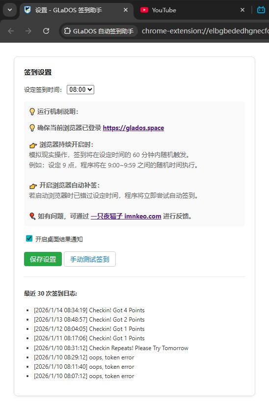

# GLaDOS 自动签到助手 (GLaDOS Checkin Helper)

这是一个轻量级的 Chrome 浏览器扩展程序，旨在帮助用户每天自动完成 GLaDOS 平台的签到任务，节省手动操作时间，防止遗忘。

## 📷 预览截图

## ✨ 功能特点

- **自动签到**：每天在您设定的时间段后自动执行签到。
- **智能重试**：基于 Chrome Alarms 机制，即使错过特定时间点，打开浏览器后也会自动补签。
- **历史记录**：本地保存最近 30 条签到日志，成功与否一目了然。
- **通知提醒**：支持可选的系统级别通知，即时反馈签到结果。
- **隐私安全**：纯本地运行，不收集任何用户账号数据。

## 🚀 安装说明

### 方式一：Chrome 商店安装（推荐）
- [点击前往 Chrome Web Store 下载](https://chromewebstore.google.com/detail/bebkcollfclnaamapnjcaggfkgdfkail)
- 

### 方式二：开发者模式安装（手动）
1. 下载或克隆本仓库到本地。
2. 打开 Chrome 浏览器，进入 `chrome://extensions/`。
3. 开启右上角的 **“开发者模式”**。
4. 点击 **“加载已解压的扩展程序”**，选择本仓库文件夹。

## 🛠 使用方法

1. 安装完成后，在浏览器插件栏找到本插件图标。
2. 右键点击图标，选择 **“选项” (Options)**。
3. 在设置页面设定您期望的 **每天签到时间（0-23点）**。
4. 确保您在当前浏览器中已登录 `https://glados.cloud`。
5. 您可以点击“立即测试”来验证配置是否正确。

## 📂 文件结构

- `manifest.json`: 插件配置文件。
- `background.js`: 后台常驻脚本，负责定时闹钟和签到逻辑。
- `options.html/js`: 插件设置界面及历史记录展示。
- `PRIVACY_POLICY.md`: 隐私政策说明。
- `icon.png`: 程序图标文件。
- `screenshot.jpg`: 预览截图。
- `README.md`: 说明文档。
- `LICENSE`: 协议文件。

## ⚖️ 许可协议
本项目采用 [MIT License](LICENSE) 许可协议。仅供学习交流使用，请勿用于非法用途。

---

*注：本工具与 GLaDOS 官方无任何隶属关系。*

